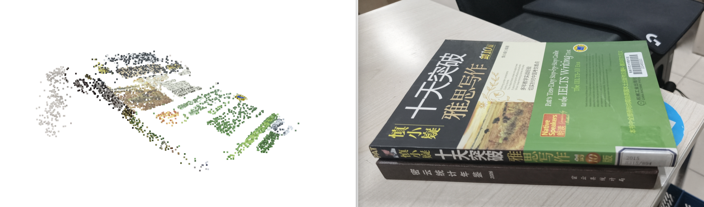
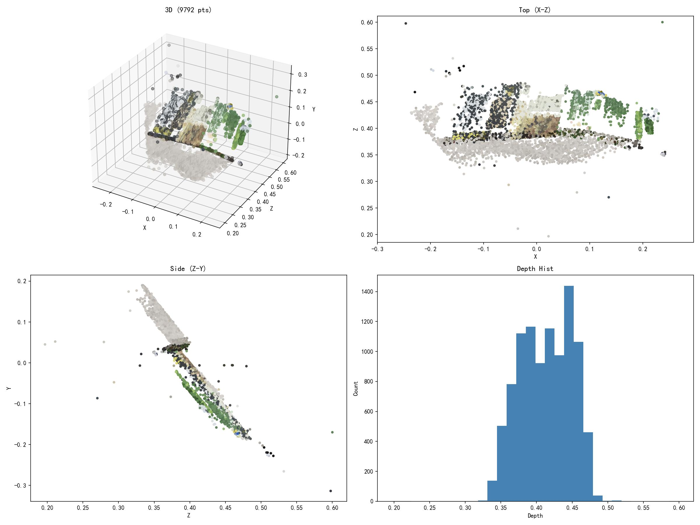

# 摄影测量与计算机视觉课程作业

**学校：** 首都师范大学 (Capital Normal University)  
**专业：** 地图学与地理信息系统 
**课程：** 摄影测量与计算机视觉  
**教师：** 谢东海  
**学生：** 赵若凡

---

## 📋 项目简介

本仓库包含摄影测量与计算机视觉课程的全部实验代码，涵盖图像处理、特征检测、相机标定、三维重建等计算机视觉核心算法的实现。所有代码均使用 Python 和 Jupyter Notebook 编写。

---

## 🏆 期末大作业：三维重建

本项目实现了基于多视图几何的三维重建流程，包括相机标定、特征匹配、本质矩阵估计、稀疏点云重建等完整pipeline。

### 重建结果展示




---

## 📂 项目结构

```
cvclass-Zhao-Ruofan/
│
├── 📁 boards/                        # 棋盘格标定图像集
│   └── *.jpg                         # 多角度棋盘格照片
│
├── 📁 data/                          # 实验数据
│   ├── calibration/                  # 标定数据
│   ├── left.jpg                      # 左视图图像
│   └── right.jpg                     # 右视图图像
│
├── 📁 images/                        # COLMAP重建输入图像
├── 📁 mvs/                           # COLMAP MVS重建结果
├── 📁 sparse/                        # COLMAP稀疏重建结果
│
├── 📁 output/                        # 输出结果目录
│   ├── 01_matches.jpg                # 特征匹配可视化
│   ├── 02_epipolar.jpg               # 极线几何可视化
│   ├── 03_3d_result.jpg              # 三维重建结果
│   ├── calibration.npz               # 相机标定参数
│   ├── sparse_pointcloud.ply         # 稀疏点云
│   └── sparse_filtered.ply           # 滤波后点云
│
├── 📁 photos/                        # 原始实验图像
├── 📁 rotition_ply结果/               # rotation.bag可视化结果
│
├── 📓 实验代码
│   ├── sobel赵若凡.ipynb             # Sobel边缘检测
│   ├── Laplace赵若凡.ipynb           # Laplace边缘检测
│   ├── canny赵若凡.ipynb             # Canny边缘检测
│   ├── Harris赵若凡.ipynb            # Harris角点检测
│   ├── SIFT点定位与可视化_赵若凡.ipynb # SIFT特征检测
│   ├── 特征点匹配赵若凡.ipynb         # 特征点匹配
│   ├── 相机标定函数赵若凡.ipynb       # 相机标定
│   ├── 本质矩阵赵若凡.ipynb           # 本质矩阵计算
│   ├── colmap赵若凡.ipynb            # COLMAP 3D重建
│   └── 3D_reconstruction_赵若凡.ipynb # 🌟 期末大作业：三维重建
│
├── 🐍 rotationview.py                # rotation.bag数据可视化脚本
├── 📊 sparse_points.ply              # rotation稀疏点云数据
├── 📄 Checkerboard.pdf               # 棋盘格标定板
├── 🖼️ DSC00480.JPG                   # 测试图像1
├── 🖼️ DSC00481.JPG                   # 测试图像2
├── 🖼️ result_photo.png               # 大作业结果展示图
└── 📖 README.md                      # 项目说明文档
```

---

## 🔬 实验内容

### 实验一：边缘检测算法

| 实验 | 文件 | 算法描述 |
|------|------|----------|
| Sobel边缘检测 | `sobel赵若凡.ipynb` | 基于一阶导数的梯度算子，计算水平和垂直方向梯度 |
| Laplace边缘检测 | `Laplace赵若凡.ipynb` | 基于二阶导数的边缘检测，对噪声敏感 |
| Canny边缘检测 | `canny赵若凡.ipynb` | 多级边缘检测：高斯滤波→梯度计算→非极大值抑制→双阈值检测 |

### 实验二：特征检测与匹配

| 实验 | 文件 | 算法描述 |
|------|------|----------|
| Harris角点检测 | `Harris赵若凡.ipynb` | 基于自相关矩阵的角点响应函数计算 |
| SIFT特征检测 | `SIFT点定位与可视化_赵若凡.ipynb` | 尺度不变特征变换，构建高斯金字塔检测关键点 |
| 特征点匹配 | `特征点匹配赵若凡.ipynb` | 基于描述子的特征匹配与RANSAC筛选 |

### 实验三：相机标定与几何

| 实验 | 文件 | 算法描述 |
|------|------|----------|
| 相机标定 | `相机标定函数赵若凡.ipynb` | 张正友标定法，估计内参、外参和畸变参数 |
| 本质矩阵计算 | `本质矩阵赵若凡.ipynb` | 八点法估计本质矩阵，恢复相机相对位姿 |

### 实验四：三维重建（期末大作业）

| 实验 | 文件 | 算法描述 |
|------|------|----------|
| COLMAP重建 | `colmap赵若凡.ipynb` | 使用COLMAP进行增量式SfM重建 |
| 三维重建Pipeline | `3D_reconstruction_赵若凡.ipynb` | 完整三维重建流程：标定→匹配→本质矩阵→三角化→点云生成 |

---

## 🛠️ 技术栈

- **编程语言：** Python 3.x
- **计算机视觉：** OpenCV, COLMAP
- **数值计算：** NumPy, SciPy
- **可视化：** Matplotlib, Open3D
- **开发环境：** Jupyter Notebook

---

## 🚀 快速开始

### 环境配置

```bash
# 克隆仓库
git clone https://github.com/Halogenname/cvclass-Zhao-Ruofan.git
cd cvclass-Zhao-Ruofan

# 安装依赖
pip install opencv-python numpy matplotlib scipy open3d jupyter

# 启动Jupyter Notebook
jupyter notebook
```

### 运行期末大作业

```bash
# 打开三维重建notebook
jupyter notebook 3D_reconstruction_赵若凡.ipynb
```

---

## 📊 数据说明

| 数据目录 | 说明 |
|----------|------|
| `boards/` | 包含11张不同角度的棋盘格图像，用于相机标定 |
| `data/` | 双目立体视觉实验数据（left.jpg, right.jpg） |
| `images/` | COLMAP三维重建的输入图像序列 |
| `output/` | 所有期末作业输出结果，包括可视化图像和点云文件 |

---

## 📈 实验结果

### 三维重建Pipeline

```
输入图像 → 特征提取(SIFT) → 特征匹配 → 本质矩阵估计 → 相机位姿恢复 → 三角化 → 稀疏点云
```

### 输出格式

- **可视化结果：** JPG/PNG 格式图像
- **点云数据：** PLY 格式，可用 MeshLab/CloudCompare 查看
- **标定参数：** NPZ 格式，包含相机内参矩阵和畸变系数

---

## 👨‍🎓 作者信息

- **姓名：** 赵若凡
- **学校：** 首都师范大学
- **专业：** GIS（地理信息科学）
- **课程：** 摄影测量与计算机视觉
- **指导教师：** 谢东海

---

## 📝 更新日志

- **2024-01** 提交期末三维重建大作业
- **2024-01** 添加COLMAP 3D重建脚本和结果
- **2024-01** 添加rotation.bag数据可视化代码
- **2023-12** 初始提交：边缘检测、特征检测、相机标定等实验

---

## 📄 许可证

本项目仅用于课程学习和学术研究目的。

---

## 🙏 致谢

感谢谢东海老师的悉心指导！